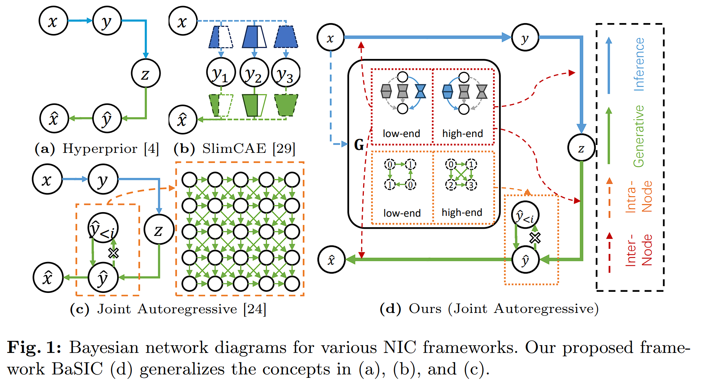

# Compression Benchmark
Repository for the ECCV 2024 paper - BaSIC: BayesNet structure learning for computational Scalable neural Image Compression.

Code is based on [FSAR](https://github.com/alipay/Finite_State_Autoregressive_Entropy_Coding).

## Introduction
Despite superior rate-distortion performance over traditional codecs, Neural Image Compression (NIC) is limited by its computational scalability in practical deployment. Prevailing research focuses on accelerating specific NIC modules but is restricted in controlling overall computational complexity. To this end, this work introduces BaSIC (BayesNet structure learning for computational Scalable neural Image Compression), a comprehensive, computationally scalable framework that affords full control over NIC processes. We learn the Bayesian network (BayesNet) structure of NIC for controlling both neural network backbones and autoregressive units. The learning of BayesNet is achieved by solving two sub-problems, i.e., learning a heterogeneous bipartite BayesNet for the inter-node structure to regulate backbone complexity, and a multipartite BayesNet for the intra-node structure to optimize parallel computation in autoregressive units. Experiments demonstrate that our method not only facilitates full computational scalability with more accurate complexity control but also maintains competitive compression performance compared to other computation scalable frameworks under equivalent computational constraints.

 

## State
- We are currently preparing for an arXiv release of this paper.
- We are currently preparing for an extension of this paper.

## Setup

### Hardware Requirements
* CUDA compatible GPU
  
### Software Requirements
* Linux/Mac system (Windows may be possible but not tested)
* gcc&g++>=7 (Required, need c++17 support to compile)
* python>=3.7 (Recommended version, need pytorch-lightning support)
* pytorch>=1.7 (Recommended version, need pytorch-lightning support)
* cudatoolkit>=10.2 (Optional but highly recommended, lower versions may be functional)

The recommended environment setup script with conda: 

```bash
conda create -n cbench python=3.7
conda install -c pytorch pytorch==1.7.1 torchvision==0.8.2 cudatoolkit=10.2
pip install pytorch-lightning==1.5.10
```
or (recommended for NVIDIA RTX 20+ series GPU)
```bash
conda create -n cbench python=3.9
conda install -c pytorch pytorch==1.12.1 torchvision==0.13.1 cudatoolkit=11.3
pip install pytorch-lightning==1.7.7
```
or (recommended for NVIDIA RTX 40+ series GPU)
```bash
conda create -n cbench python=3.10
conda install pytorch==2.1.2 torchvision==0.16.2 torchaudio==2.1.2 pytorch-cuda=11.8 -c pytorch -c nvidia
pip install pytorch-lightning==1.9.5 numpy==1.23.5
```

Finally, 
```bash
# if gcc version < 7
conda install -c conda-forge gcc gxx
pip install -r requirements.txt
python setup.py build develop
```

### Known Issues
If link errors are encounted during compilation in setup.py, try uncomment lines with "extra_link_args" in setup.py and rerun this setup script.

### (Optional) Environment setup according to your machine
See configs/env.py


## Dataset Prepare
We mainly use the following datasets in our experiments:
* [ImageNet subset](https://image-net.org/download.php) : See [this repo](https://github.com/VincentChandelier/QRAF) for how to preprocess the dataset, or use tools/prepare_dataset.py modified by us. The result folders would be:
  * data/ImageNet/subset_8000_processed
* [Kodak](https://r0k.us/graphics/kodak/) : Download all images to data/Kodak

## Code Structure
* configs : All parameter setting configs
* cbench : All algorithm codes
  * benchmark : Tools for experiments and comparisons
  * csrc : c/c++ codes, with an efficient ANS-based entropy coder interface/implementation. (Should be more efficient than CompressAI implementation, we use pybind11 Tensor support to avoid memory format conversion between python and c++.)
  * codecs : All compression codecs
  * data : Tools for data loading and processing
  * modules : Mainly compression modules
    * entropy_coder/latent_graph.py : is the major utility for building NIC codecs. See its doc.
  * nn : Neural network codes.
  * utils : Misc tools.
* tests : To test if some modules are functional.
* tools : Tools to run experiments.
  * run_benchmark.py : Use this for all experiments!

## Experiments
For any experiment you want to run (including Training/Validation/Testing, thanks to pytorch-lightning and our BasicLosslessCompressionBenchmark):
```bash
python tools/run_benchmark.py [config_file]
```

You can use tensorboard to visualize the training process.
```bash
tensorboard --logdir experiments
```

### Experiment List
See configs.
* configs/lossy_graph_scalable_exp.py: computational scalable experiments and ablation studies with Joint Autoregressive framework
* configs/lossy_graph_scalable_exp_hp.py: computational scalable experiments and ablation studies with Hyperprior framework
* configs/lossy_latent_graph_topogroup.py: autoregressive model experiments and ablation studies

### Model Implementation List
See configs/presets.
* configs/presets/lossy_latent_graph_scalable_ar_models.py:
  * "hyperprior-ar-sc-slimmable-full-dynamic-grouped" is BaSIC with fixed autoregressive model (intra-node BayesNet).
  * "hyperprior-ar-sc-slimmable-full-dynamic-grouped-greedy-search-8level" is BaSIC with greedy-searched slimmable levels.
  * "hyperprior-ar-sc-slimmable-full-dynamic-combined-dynamic-entropy-coder-grouped" is BaSIC with dynamic autoregressive model (intra-node BayesNet).

### Pretrained Models
TBA

tools/run_benchmark.py can automatically look for config.pth in a given directory to build the benchmark. Therefore, to test a pretrained model, simply run:
```bash
python tools/run_benchmark.py [model_directory]
```

## Citation
TBA
```bibtex

```

## Contact
TBA